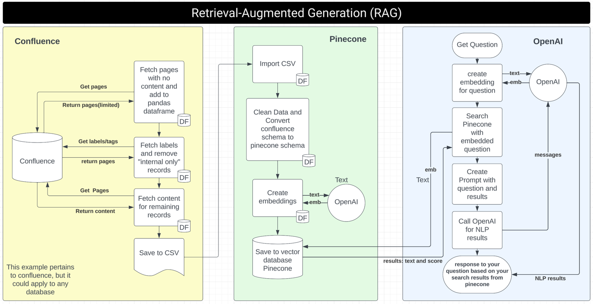

# Retrieval Augmented Generation with Confluence, Pinecone, and OpenAI

This project integrates Confluence, Pinecone, and OpenAI to implement a retrieval augmented generation system. It is designed to run on Python 3.9.6.

[YouTube Video](https://youtu.be/zjdFOwBxBRo)

## Prerequisites

- Python 3.9.6
- Virtual environment (recommended)
- Visual Studio Code (recommended for environment setup)

## Setup Instructions

### 1. Clone the Repository

Start by cloning this repository to your local machine.


### 2. Create a Python Virtual Environment

It is recommended to run the project within a Python virtual environment to manage dependencies effectively.

- **Using Visual Studio Code**: Click on `View`, then Click on `Command Palette`, search for `Python: Create Environment`, or use the shortcut `Command+Shift+P` and search for the same option.
- **Using Terminal**:

```bash
python3 -m venv venv
source venv/bin/activate  # On Windows use `venv\Scripts\activate`
```

### 3. Install Dependencies

After activating the virtual environment, install the required dependencies.

```bash
pip install -r requirements.txt
```

### 4. Environment Variables

Create a `.env` file in the root directory of the project to store your API keys and other configurations.

```plaintext
OPENAI_API_KEY=<your_openai_api_key>
PINECONE_API_KEY=<your_pinecone_api_key>
CONFLUENCE_DOMAIN=<your_confluence_domain>
USERNAME=<your_username>
PASSWORD=<your_password>
```

## Running the Applications

### Import Data from Confluence

To import your data from Confluence, run the following command:
Review the main function of the application to understand the flow of the application.

```bash
python app_confluence.py
```

### Run Pinecone and OpenAI Application

To execute the Pinecone and OpenAI integration:
Review the main function of the application to understand the flow of the application.

```bash
python app_pinecone_openai.py
```

## Additional Resources

- **RAG Flow Chart**: Please refer to the `rag_flowchart.png` in the repository for a visual representation of the system workflow.


## Thank you and happy coding!
